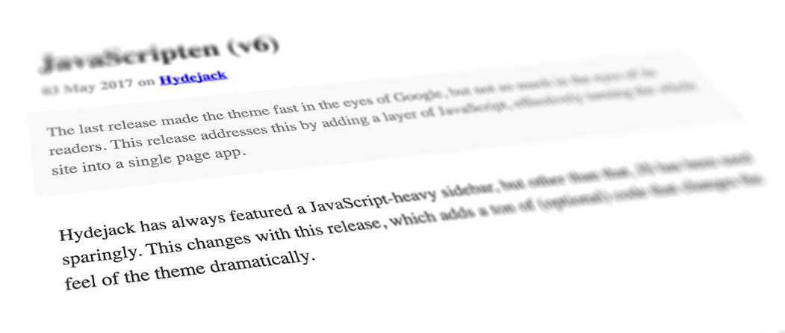

{:.lead}

## Usage
To use this flavor, make the following changes to following files:

### `_config.yml`

~~~yml
google_fonts: ''
font:         serif
font_heading: serif

accent_color: '#00e'
accent_image: /hydejack/assets/img/oldschool-bg.jpg

hydejack:
  no_google_fonts: true
~~~

### `_sass/my-inline.scss`

~~~css
.project-card, .project-card-img, .pagination-item > * {
  border-radius: 0!important;
}

code, pre {
  font-family: monospace!important;
}

blockquote {
  border-left: none!important;

  &.lead {
    padding-left: 2rem;
  }
}

.avatar {
  border-radius: 0;
}

a {
  border-bottom: none!important;
  text-decoration: underline!important;
}

.sidebar-social a, .menu {
  text-decoration: none!important;
}
~~~

***

## Attributions

| Work                                                    | License        | Changes
|:------------------------------------------------------- |:---------------|:-
| [Sun SparcStation 10 with CRT.jpg][11] by Thomas Kaiser | [CC-BY-SA-3.0] | Sun logos removed, perspective distortion
| [iPhone 6S Rose Gold.png][21]                           | [CC-BY-SA-3.0] | Desaturated
| [iPad Air 2.png][31] by [Justinhu12][32]                | [CC-BY-SA-4.0] | Desaturated
| [Mandel zoom 08 satellite antenna.jpg][41]              | [CC-BY-SA-3.0] | None

Screenshots can be reused under [CC-BY-SA-4.0].

[11]: https://commons.wikimedia.org/wiki/File:Sun_SparcStation_10_with_CRT.jpg
[21]: https://commons.wikimedia.org/wiki/File:IPhone_6S_Rose_Gold.png
[31]: https://commons.wikimedia.org/wiki/File:IPad_Air_2.png
[32]: https://commons.wikimedia.org/wiki/User:Justinhu12
[41]: https://commons.wikimedia.org/wiki/File:Mandel_zoom_08_satellite_antenna.jpg

[CC-BY-SA-4.0]: https://creativecommons.org/licenses/by-sa/4.0/
[CC-BY-SA-3.0]: https://creativecommons.org/licenses/by-sa/3.0/
